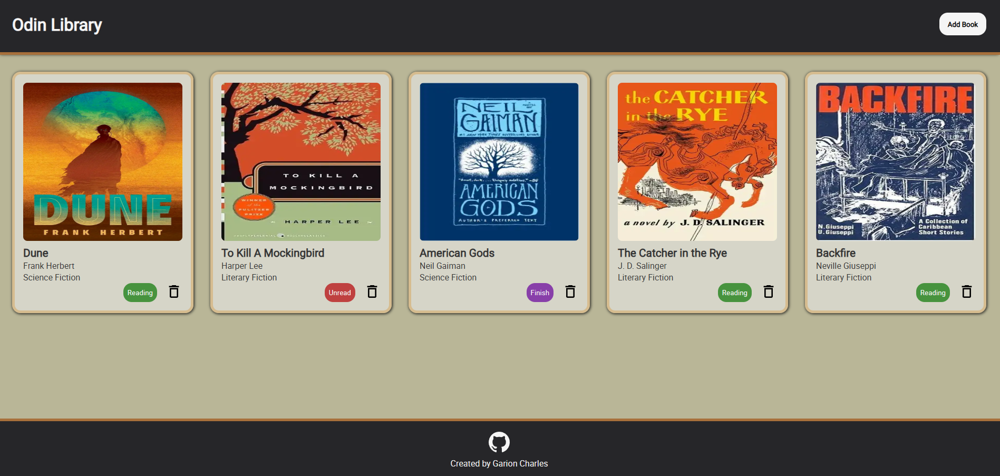

# Odin-Library

## Introduction

This is the third project in The Odin Project's Node path. Its purpose is to demonstrate how to use objects to organize code, utilizing object constructors and prototypal inheritance for better efficiency and memory conservation. To demonstrate these concepts, I created a simple Library application that tracks books I am currently reading, planning to read, or have recently finished. Each book is stored in its own object, and the entire collection is displayed by accessing a central array and manipulating the DOM.

## Tech Stack

- HTML
- CSS
- Javascript
- VS-CODE
- CANVA

## Skills Demonstrated 

- Created A Book Constructed for easily creating new book objects
- Created Prototype function to easily manipulate individual objects properties.
- Perform best practices for SEO my converting images to webp format and fonts to woff format.
- Created a modal form and extracted the data via javascript to add user data to new book objects and store said data in the gobal array library.
- Applied advance styling to selection input to ensure consistant styling in the form.

## Application Design

